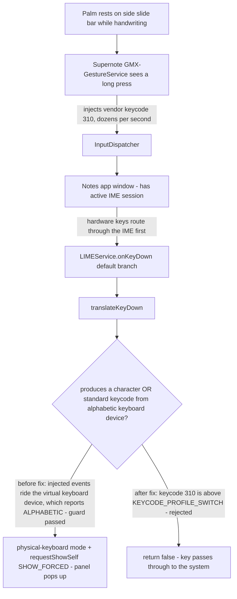

2026-07-28

# Sweet LIME: slide-bar palm touch popped up the IME panel (v7.1.4 hotfix)

## What was broken

On the Supernote Nomad, writing in the Notes app with Sweet LIME as the active
IME kept summoning the keyboard panel: whenever the right palm rested on the
device's side slide bar, the Sweet LIME input panel appeared over the note.
This happened even on v7.1.3, which already contained a fix (2f977a7) meant to
stop hardware/vendor keys from popping up the IME.

## Root cause

Long-pressing the side slide bar is a built-in Supernote gesture for summoning
the keyboard. A palm resting on the bar reads as exactly that long press.
When it triggers, the vendor's system service (`GMX-GestureService`) injects
**vendor keycode 310** into the focused app — dozens of times per second while
the palm stays down (confirmed in logcat: a storm of
`translateKeyDown(): keyCode=310` lines, one per injected event).

The slide bar itself is two kernel input devices — `ratta-slide` (slide
gestures mapped to DPAD_LEFT/RIGHT and F13–F30) and `fts_slide_ts` (its touch
controller, with W/E/U/O gesture codes) — but both report
`KeyboardType: NON_ALPHABETIC`, so the 2f977a7 guard would have rejected keys
coming from them directly. The injected events are different: **injected keys
ride Android's virtual keyboard device, and the virtual keyboard reports
`KEYBOARD_TYPE_ALPHABETIC`**. That satisfied the guard's "comes from a real
alphabetic keyboard" escape hatch, so keycode 310 was treated as
physical-keyboard typing. `translateKeyDown()` then flipped into physical mode
and force-showed the IME window via `requestShowSelf(SHOW_FORCED)` — this
happens *before* the method's final `c == 0` check would have bailed out, so
the panel appeared even though the key types nothing.

## The fix

Tighten the guard in `LIMEService.translateKeyDown()`: a key only counts as
physical-keyboard typing when it **produces a character**, or is a **standard
keycode** (at most `KEYCODE_PROFILE_SWITCH` = 288, the end of Android's
official keycode range) **from an alphabetic keyboard device**. Vendor
frameworks assign their custom keycodes above the standard range, so injected
codes like 310 now return early and pass through to the system untouched —
regardless of which device they claim to come from.

External keyboards are unaffected: their typing keys produce characters, and
their editing/navigation keys are standard keycodes from a genuinely
alphabetic device.

## Investigation notes worth keeping

- The keycode-310 storm was visible with plain `adb logcat` because
  `translateKeyDown()` logs unconditionally at entry — that log line sits
  *before* the guard, so seeing it does not mean the key was accepted.
- `dumpsys input` shows per-device `KeyboardType` under the InputReader
  section; that is what ruled out the raw slide-bar devices as the source.
- Replicating the palm press via `sendevent` failed — writing to
  `/dev/input/*` needs root on this device — so the confirmation came from
  correlating the GestureService motion logs, InputDispatcher key dispatches,
  and LIMEService's own log lines in the same time window.

Released as v7.1.4 (versionCode 714), commits 2d01dd9 (fix) and 239bdb1
(version bump).
