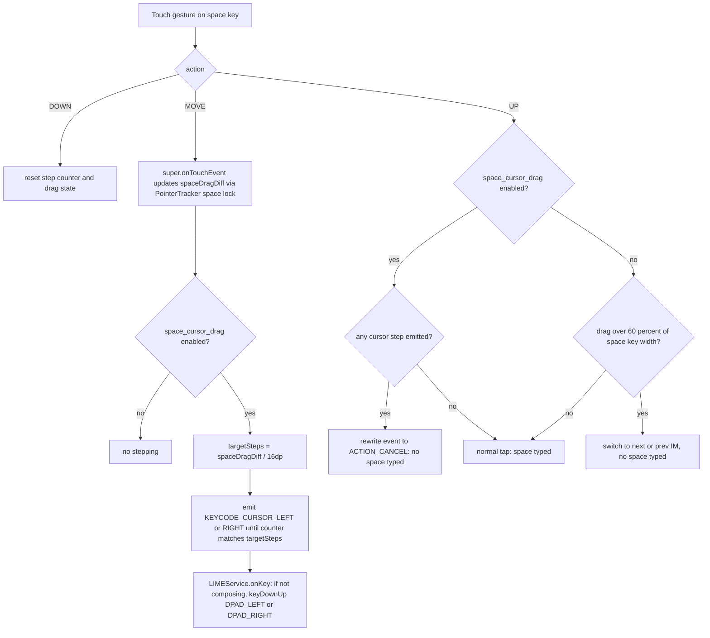

2026-08-04

# Sweet LIME: swipe on the space bar to move the text cursor (opt-in setting)

Sweet LIME now supports Gboard-style cursor navigation: with the new setting enabled, dragging a finger horizontally across the space key moves the text cursor left/right — one step per ~16dp of travel, live while dragging, with mid-drag reversal walking the cursor back. Releasing after a drag types no space; a plain tap still types one. The setting (「空白鍵滑動移動游標」, key `space_cursor_drag`) is **off by default**, so out of the box nothing changes: space-drag still switches input methods and long-pressing space still opens the options popup.

## Why it was easy: the drag pipeline already existed

The feasibility check found that Sweet LIME already had a horizontal space-drag gesture wired end-to-end — `LIMEKeyboard.isInside()` locks the touch onto the space key once entered (the key index never changes for the rest of the gesture) and tracks a live pixel delta (`mSpaceDragLastDiff`), which `LIMEKeyboardView.onTouchEvent()` consumed on release to switch to the next/previous input method when the drag exceeded 60% of the key width. The cursor feature is a re-targeting of that pipeline, not new gesture detection: on every `ACTION_MOVE` (after the base class has updated the delta), the view converts the accumulated delta into cursor steps and emits new pseudo-keycodes `KEYCODE_CURSOR_LEFT`/`KEYCODE_CURSOR_RIGHT` (-107/-108), which `LIMEService` turns into `DPAD_LEFT`/`DPAD_RIGHT` key events.

Because the two gestures occupy the same axis on the same key, they can't coexist: when the setting is on, cursor drag replaces drag-to-switch-IM (IM switching remains available via the long-press options popup). When off, the old code path is untouched.

## Design decisions

- **Step size 16dp (floored at scaled touch slop), deliberately larger than the long-press guard.** `onLongPress` already refused the space popup when the drag delta exceeded `mKeyHeight/5` (~9dp). With steps at 16dp the ordering is: a real drag first suppresses long-press (9dp), then starts stepping (16dp) — so the popup can't fire mid-drag. One leak remained: drag out past 16dp then back under 9dp before the 400ms timer — closed by adding `!mSpaceCursorMoved` to the guard. Pure long-press with no drag still opens the popup even with the setting on.
- **Space suppression reuses the existing `ACTION_CANCEL` rewrite.** The IM-switch path already swallowed the space character by rewriting the UP event to `ACTION_CANCEL` before passing it to the base class (routing to `PointerTracker.onCancelEvent`: timers cancelled, highlight cleared, no key committed). The cursor path takes the identical exit whenever any step was emitted — including a drag that nets back to zero.
- **DPAD events, not `setSelection()`.** `ic.setSelection()` is commented out elsewhere in `LIMEService` with a note that it broke input in Chrome. The new keycodes go through `keyDownUp(..., sendToSelf=false)`, the same semantics as the skin-toolbar cursor buttons — `sendToSelf=false` matters because the service otherwise hijacks DPAD for candidate-list navigation while candidates are shown.
- **Ignored during composition.** Space has commit semantics while text is being composed; raw DPAD events would move the cursor through the composing region and desync `mComposing`. The service drops the cursor keycodes whenever `mComposing` is non-empty.
- **Setting cached off the hot path.** The boolean is read once per `setKeyboard()` (which runs on every `onStartInputView`), following the `key_press_highlight` pattern — no SharedPreferences hit per MotionEvent, and toggling the setting takes effect on the next editor focus without an IME restart.
- **Preference XML edited in both copies.** The repo keeps `res/xml/preference.xml` and `res/xml-v17/preference.xml` in sync by convention (xml-v17 is the one actually loaded given minSdk 21); the checkbox went into the keyboard category of both, with zh-TW and zh-CN strings.

## Files

- `keyboard/LIMEKeyboardView.java` — gesture core: step emission on MOVE, space suppression on UP, long-press guard, cached setting
- `LIMEService.java` — `KEYCODE_CURSOR_LEFT/RIGHT` → `keyDownUp(DPAD_*, false)` with composing gate
- `global/LIMEPreferenceManager.java` — `getSpaceCursorDrag()`
- `res/xml/preference.xml` + `res/xml-v17/preference.xml`, `res/values/strings_settings.xml` + `res/values-zh-rCN/strings_settings.xml`

Verified by building the signed release and installing to the Hisense A7 e-ink phone (commit `fbd5eae`). Released as v7.4.0.
