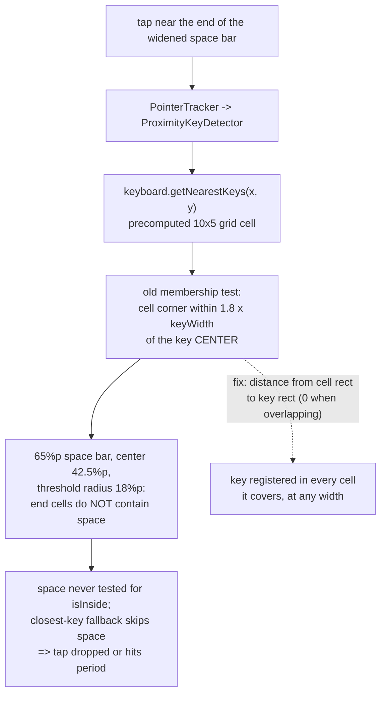

2026-08-03

# Widened space bar had untappable ends

With a `.cskin` skin active, taps on the far left/right of the space bar did
nothing — or typed a period. The skin tweaker removes the EN/123/hide keys
the toolbar covers and hands their width to the space bar, growing it from
35%p to ~65%p; the ends of that bar were dead.

## Root cause

Touch lookup never scans all keys. `LIMEBaseKeyboard` precomputes a 10x5
grid (`computeNearestNeighbors`), and `ProximityKeyDetector` only tests the
keys registered in the tapped cell. A key was registered in a cell only if
a cell corner was within `SEARCH_DISTANCE (1.8) x defaultKeyWidth` of the
key's **center** (`squaredDistanceFrom` measures center distance) — an
implicit assumption that no key is wider than ~3.6 default keys. The stock
35%p space bar (half-width 17.5%p vs the 18%p threshold) just barely fit,
which is why this never surfaced before skins.

The tweaked 65%p bar (center 42.5%p) leaves every cell left of ~24.5%p or
right of ~60.5%p without the space key — ~14.5%p of dead bar on each end.
A dead-end tap either matches nothing (`isInside` is never evaluated for a
key absent from the cell) or falls through to the closest-key fallback,
which excludes space by design (`codes[0] > 32`) and can pick the
neighboring period key instead.

## Fix

`computeNearestNeighbors` now measures the distance from the cell
rectangle to the key rectangle — zero when they overlap — so a key is
registered in every cell it covers plus the same 1.8-key proximity margin.
`squaredDistanceFrom` itself is untouched, so proximity-correction ranking
is unchanged. Verified on the emulator: pre-fix, edge taps dropped (left)
and typed `.` (right); post-fix, all space-bar taps register. Shipped in
v7.3.1.
