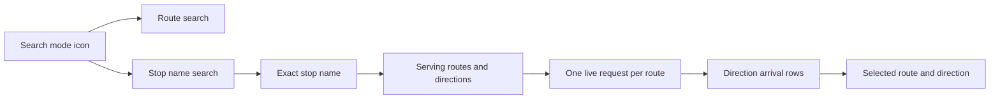

2026-10-02

# Stop-first bus search and home-screen shortcuts

Bus search now separates route lookup from stop lookup, so a rider can choose a stop and immediately see every route and direction serving it. The compact search bar contains one mode icon: tapping it switches between routes and stops. Empty input leaves the results area blank, and the clear button appears only after entering text. Redundant headings, row chevrons and explanatory subtitles have been removed.

The former search combined route names, destinations and stop matches into route cards. That made the rider scan repeated stop information across routes. The new catalogue queries return unique stop names and use exact name matching to collect serving route paths and stop IDs. Arrival requests run once per route, with each serving direction displayed separately. Request and screen generations discard replies after navigation. Same-named boarding locations remain grouped because physical-platform identification is outside the current catalogue integration.

Stops support home-screen shortcuts from a long press on either a search result or the stop detail title. Shortcut intents open the arrival screen on warm and cold launches. The icon renders the first two Unicode characters of the stop name, while its launcher label retains the full name. Existing pinned icons update when the app starts. Route shortcuts retain their selected direction.

Long route and stop labels shrink when they wrap. Route badges now measure their full content rather than clipping two lines inside a fixed height. An inline vector drawable places the direction arrow immediately after the origin name instead of separating endpoints into equally weighted columns.

The README now explains installation and rider-facing features in Traditional Chinese, with actual Android screenshots. Build instructions live separately in docs/DEVELOPING.md. Debug and signed-release builds and lint passed, catalogue/parser checks passed, and Android emulator verification covered the software keyboard, search mode preservation, live arrival rows, route direction navigation, pinned stop shortcuts and cold launches. The signed build was also installed successfully on the Palma 2 Pro before release preparation.
