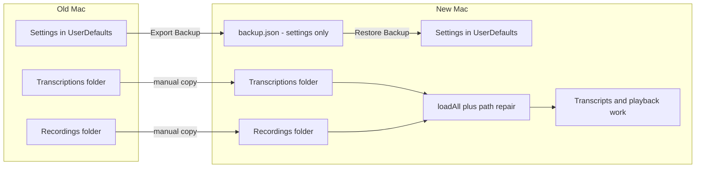
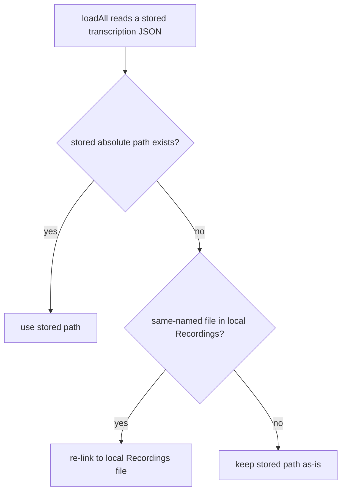

# WhisperASR — Backup & Restore for moving to a new Mac

## Summary

Added a **Backup & Restore** section in Settings that exports all app
configuration to a single JSON file and restores it on another Mac. The backup
carries **only settings** — not transcription metadata — because the user copies
the `Recordings/` and `Transcriptions/` folders manually, and the app now repairs
the broken recording paths that result from moving between machines.

The whole point of the feature is a smooth migration when replacing a Mac:

1. Copy `Recordings/` and `Transcriptions/` into
   `~/Library/Application Support/WhisperASR/` on the new Mac.
2. Settings → **Restore from Backup…**, pick the exported `.json`.
3. Re-download the speech model (not backed up — it is large and re-downloadable;
   it auto-selects when the download finishes).

## Approach

**What's in the backup.** Only the persisted `UserDefaults` keys, which live
outside both folders: `selectedModelFile`, `modelPath`, `targetLanguage`,
`translationEndpoint`, `translationModel`, `translationAPIKey`,
`transcriptFontSize`, `liveTranslationPref`, `recentRecordingApps`. The file is a
small JSON (`BackupFile`) with a `version` for forward-compatibility, a
`createdAt`, and the app version. Restore writes each present key back; absent
keys leave the current value untouched. The API key is included for a no-friction
move (it is already stored in plaintext UserDefaults today), so the file is
sensitive and should be kept private.

**Why metadata is deliberately excluded.** The `Transcriptions/` folder already
*is* the metadata: `TranscriptionStore.loadAll()` reads
`~/Library/Application Support/WhisperASR/Transcriptions/*.json` to populate the
list and render every transcript. Duplicating that into the backup would bloat
the file (≈1.9 MB for only 19 items) and create a second, staleable source of
truth. The first design embedded the metadata and re-linked on restore; it was
slimmed to config-only once the path-repair below made the manual folder copy
self-sufficient.

**The actual migration fix — path repair on load.** Each per-item JSON stores its
recording as an *absolute* path containing the username
(`/Users/OLD/Library/.../Recordings/foo.m4a`). On a new Mac with a different home
folder that path is dead, so the transcript would show but playback couldn't find
the audio. `TranscriptionStore.resolveRecordingURL()` heals this on load,
independently of the backup:

Because repair only triggers when the original path is missing, files that
legitimately live elsewhere (e.g. drag-dropped) are left untouched. Healing is
in-memory; the corrected path persists naturally on the next save of that item.

**Verification.** Round-tripped the config against real data (the API key and the
boolean pref survive encode/decode), and simulated a new-Mac username against the
repair logic: 15 of 19 transcriptions re-linked automatically by filename; the
rest reference audio not present in `Recordings/` and are left as-is.

## Trade-offs

- **Settings-only, not a full archive.** Restore does not recreate transcriptions;
  it relies on the user copying the two folders. This matches the stated workflow
  and avoids duplicated/stale data, at the cost of the backup not being a
  one-file "restore everything but audio" bundle.
- **API key travels in the file.** Convenient (no re-entry on the new Mac) and
  consistent with its existing plaintext storage, but the file must be treated as
  a secret.
- **Restored model selection clears if the model isn't downloaded yet.**
  `ModelManager.refresh()` drops a selection whose file is absent — correct
  behavior (can't use a missing model), and it re-selects automatically once the
  model is downloaded.

## Key Files

- `Sources/BackupService.swift` (new) — `BackupFile`/`BackupConfiguration` DTOs,
  `makeBackup()`, `encode`/`decode` (ISO-8601 dates), and `@MainActor restore()`
  which writes config to UserDefaults and nudges `ModelManager`.
- `Sources/TranscriptionStore.swift` — `resolveRecordingURL()` heals broken
  recording paths in `loadAll()`; this is the migration fix and works without the
  backup.
- `Sources/SettingsView.swift` — the **Backup & Restore** section: Export
  (`NSSavePanel`), Restore (`NSOpenPanel` + confirmation dialog), status line.
