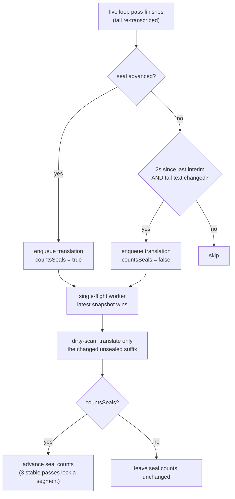

2026-07-16

# WhisperASR: translate the live tail between pauses

Live translation now updates mid-utterance instead of only at phrase
boundaries. Previously a translation pass ran solely when the transcription
seal advanced — that is, after a ≥300 ms silence — so during a long
uninterrupted sentence the translation pane sat frozen for up to 12 s (the
forced-cut cap). That throttle was designed around whisper's pace; with the
new Nemotron streaming engine finishing transcription passes in well under
a second, translations were the visibly lagging half of the live view.

## What changed

Seal-anchored translation passes behave exactly as before. Between seals,
the in-progress tail is now also translated on a **2-second debounce**,
gated on the snapshot text actually having changed. The cadence is
self-limiting per engine: Nemotron's sub-second passes hit the 2 s floor,
while whisper's multi-second passes continue at roughly their own pace —
so whisper behavior is essentially unchanged.

## Why it stays cheap and stable

The existing machinery already made frequent passes safe — the trigger was
the only conservative part:

- The worker is single-flight with a latest-wins snapshot slot, so bursts
  collapse; the effective floor is `max(2 s, translation-API latency)`.
- The dirty-scan sends only the changed unsealed suffix (typically the last
  segment or two) to the API, and an unchanged snapshot produces no API
  call at all.

The one genuine risk was seal-count inflation: a segment's translation is
permanently locked after its source text survives 3 consecutive passes
unchanged, a threshold calibrated to seal-paced passes. Interim passes now
carry `countsSeals = false` and never advance those counts (a superseded
seal-anchored snapshot hands its counting duty to the newer snapshot that
replaces it in the queue). Locking is therefore exactly as conservative as
before — interim passes can refresh a translation but never freeze one.

A small companion fix in the recording window: the auto-scroll tail anchor
grew from 1 pt to 28 pt, keeping the newest transcript line clear of the
Cancel/Finish action bar when a translation arrives after the scroll has
already happened and grows the row.

Shipped in v0.7.0 together with the Nemotron engine (see
[whisperASR-nemotron-coreml-engine](whisperASR-nemotron-coreml-engine.md)).
