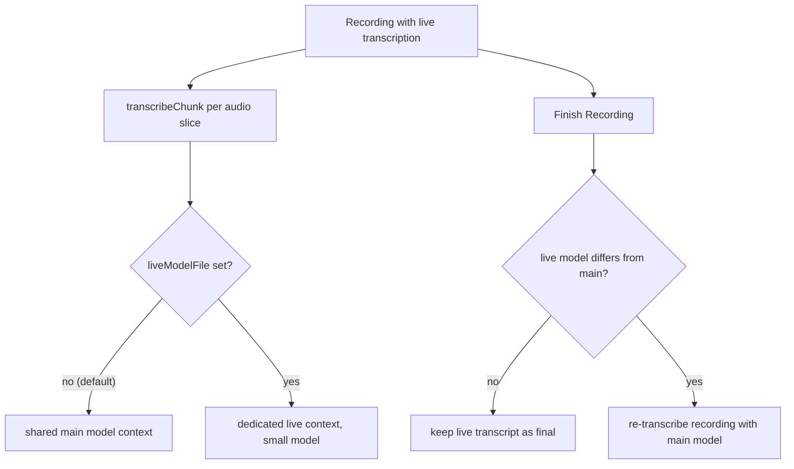

2026-07-30

# WhisperASR: Separate Model for Live Transcription

## What it does and why

Live transcription during recording can now run on a different — usually smaller and faster — model than the one used for regular file transcription. A big model like Breeze-ASR-25 gives the best final transcript but can struggle to keep up with real-time audio chunks; a small model like Whisper Base keeps the live captions fluid. Previously both paths were hard-wired to the single selected model, forcing a choice between live latency and final quality.

The live model is picked in two places, both backed by the same setting (UserDefaults `liveModelFile`):

- the toolbar model menu (cpu icon) gained a second "Live Transcription Model" section, and
- the pre-recording dialog shows a compact "Live model:" picker whenever the Live toggle is on.

The default is "Same as transcription model", which behaves exactly as before.

## Draft vs final transcript

The point of the feature is "fast live, better later", so the finish-recording behavior had to change accordingly: when the live model differs from the main one, the live transcript is treated as a **draft**. Finishing the recording sends the saved audio through the normal transcription queue, and the main model produces the final transcript. Only when live ran on the same model are its results kept as final (the pre-existing skip-re-transcription path). If the audio file failed to save, the live transcript is kept regardless — it is the only record of the session.

## Two whisper contexts, one queue

`TranscriptionService` previously held one whisper context, reloading it whenever the resolved model path changed. With two model roles that design would thrash: a file transcription (big model) interleaving with live chunks (small model) on the shared serial queue would reload multi-gigabyte weights on every alternation.

Instead the service now keeps a second context dedicated to the live model:

- `transcribeChunk()` and the recording-start preload resolve through `resolveLiveModelPath()` — the live selection when set and present on disk, else the main resolution.
- When the live selection resolves to the same file as the main model, the main context is shared rather than loading the same weights twice.
- When they differ, both contexts stay resident for the duration of the session, so file and live transcriptions interleave without reloads. Whisper contexts are independent; only the serial queue is shared, which it always was.
- `stopLiveTranscription()` frees the dedicated live context immediately — the small model does not linger in memory after recording ends.

Engine routing (whisper .bin file vs Nemotron Core ML directory) applies per role, so live can run Nemotron while files use whisper or vice versa. That surfaced one latent eviction hazard: file transcription on the whisper engine used to unconditionally unload the Nemotron engine ("the two engines never run together" — true when there was only one model role). A `liveNemotronActive` flag now blocks that eviction while a live session is using Nemotron.
