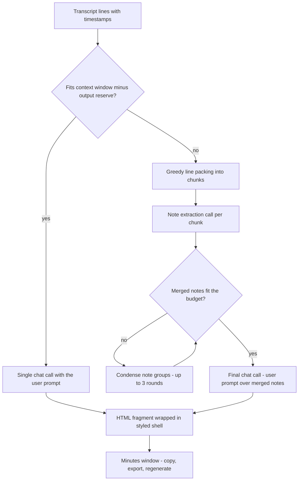

2026-07-16

# WhisperASR: Meeting Minutes Generation from Transcripts

WhisperASR 0.8.0 turns a finished transcript into structured meeting minutes (會議記錄) with one click. A new **Meeting Minutes** menu in the transcript toolbar lists the user's prompt templates; picking one opens a dedicated window where the minutes render as styled HTML in an embedded `WKWebView`. From there the user can copy the result (as rich text that pastes formatted into Mail/Word/Google Docs, or as raw HTML source), export a self-contained `.html` file, or regenerate with a different template.

## Why this shape

- **Reuse the existing OpenAI-compatible client.** The app already had an LLM client for translation (`TranslationService`) with endpoint/API key/model stored in UserDefaults. Minutes generation shares that exact configuration — no second API setup for the user. The shared HTTP retry helper was made internal, and the error strings were generalized ("API error" instead of "Translation API error") since two features now surface them. The Settings section was retitled from "OpenAI Translation API" to "OpenAI API".
- **HTML as the output contract.** The model is instructed (via a fixed system prompt, independent of the user's template) to emit only an HTML fragment — semantic headings, lists, and tables. The app wraps the fragment in a styled shell with `color-scheme: light dark` CSS so the webview follows the system appearance. Code fences are stripped defensively since models sometimes wrap output despite instructions.
- **Prompt templates live in Settings.** Users run different kinds of meetings, so templates (name + instruction text) are user-editable, persisted as JSON in UserDefaults, seeded with a general-purpose default, and included in Backup & Restore. The store never goes empty — deleting the last template re-seeds the default.
- **Toolbar placement in the detail pane**, following the project convention that new toolbar items go in the detail pane so the sidebar's Record button never overflows.

## Handling transcripts longer than the context window

Meeting recordings routinely exceed a model's context. Settings exposes a "model context window" value (default 16,000 tokens); the generator estimates the transcript size with a CJK-aware heuristic — CJK characters count as one token each, other text as three characters per token, deliberately overestimating so chunks stay safely inside the window. Short transcripts go through a single chat call; long ones are map-reduced:

Each map step extracts detailed plain-text notes (decisions, action items, names, numbers) in the transcript's own language; the reduce step condenses hierarchically only if the merged notes still exceed the budget. Progress is surfaced in the window as human-readable phases ("Summarizing part 2 of 5", "Condensing notes", "Writing minutes").

## Landing page

The GitHub Pages site (`docs/index.html`) gained a featured Meeting Minutes card. Its screenshot was produced by rendering the app's exact HTML shell (same CSS, dark appearance) with sample bilingual minutes through an offscreen `WKWebView` snapshot — pixel-identical to what the minutes window displays, without needing to burn an API call. The download button now points at the `releases/latest/download` URL instead of a pinned version, so it can no longer go stale (it still pointed at v0.5 when v0.7 was current).

The page is now bilingual: a 中文/EN button in the nav swaps every text node through a `data-i18n` key dictionary in the page's own script — a single HTML file, no duplicated page to keep in sync. The choice persists in localStorage, and browsers reporting a Chinese locale default to Traditional Chinese. The models screenshot was refreshed to the current seven-model catalog (Nemotron 3.5 included), and the copy corrected from six to seven models.

## Generation state and the window

`MinutesGenerator` is a main-actor `@Observable` singleton holding the current phase (idle / generating / completed / failed), the HTML fragment, and the source item. A UUID generation token guards against a superseded task's late progress or result clobbering a newer run. The window is a single SwiftUI `Window` scene; failed states show the error with an "Open Settings" shortcut (the common failure is a missing API key), and regeneration is available for any prompt as long as the source item still exists.
