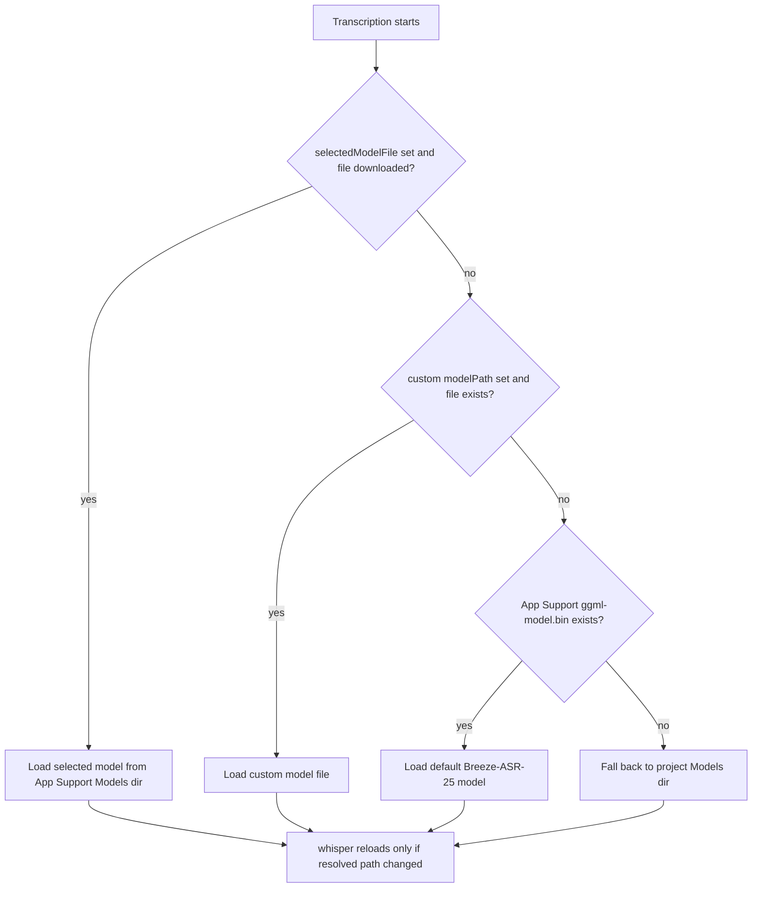

# WhisperASR: Downloadable Model Catalog with Selectable Transcription Model

## Summary

WhisperASR previously supported a single hard-wired model (Breeze-ASR-25, ~3 GB) downloaded via a first-run sheet or converted manually with a script. This change adds a catalog of six downloadable GGML models — Breeze-ASR-25 plus the official whisper.cpp multilingual builds (large-v3-turbo ~1.6 GB, medium ~1.5 GB, small ~488 MB, base ~148 MB, tiny ~78 MB) — and lets the user download any of them in-app and choose which one transcribes new audio.

Commit: `1122c30` (feat: downloadable model catalog with selectable transcription model)

## Approach

- **`ModelCatalog`** is a static list of `WhisperModelInfo` entries (id, display name, file name, Hugging Face URL, approximate size). All downloads land in `~/Library/Application Support/WhisperASR/Models/`.
- **`ModelManager`** (shared `@Observable` singleton) scans that directory for downloaded files, owns one `ModelDownloader` per catalog entry, and persists the active selection in UserDefaults as `selectedModelFile`. Downloaders are pre-created in `init` so SwiftUI body evaluation never mutates observable state. Finishing a download auto-selects that model, so a user's explicit download takes effect immediately.
- **`ModelDownloader`** was generalized from a Breeze-only singleton to a per-model instance: per-model resume-data files, ETA fallback from the catalog's size estimate, and a main-queue `onFinished` callback into the manager.
- **UI surfaces**:
  - *Settings → Speech Recognition Models*: one row per catalog model with a radio selector (downloaded models only), Download/Resume button with inline progress and cancel, and a delete button behind a confirmation dialog.
  - *First-run sheet* (`ModelDownloadView`): now includes a model picker, so new users can start with a small model instead of the 3 GB default.
  - *Toolbar* (`ModelPickerMenu`): a menu showing the active model, an inline picker of downloaded models, and a "Manage Models…" `SettingsLink`. It lives in the **detail pane's** toolbar, not the sidebar's — the sidebar column (min 220 pt) is narrow enough that a third item pushed the Record button into the overflow menu, and Record must always stay visible.
- **Resolution** stays lazy and backward-compatible: `TranscriptionService.resolveModelPath()` is called on every transcription and the whisper context reloads only when the resolved path changes, so switching models takes effect on the next transcription with no restart. Existing installs keep working: the legacy `ggml-model.bin` is recognized as the downloaded Breeze model, and the empty-selection ("Automatic") path preserves the old custom-path → App Support → project-directory fallback chain.

## Trade-offs

- **Global selection, not per-item**: the chosen model applies to all subsequent transcriptions rather than being pickable per file. Simpler model lifecycle (one loaded whisper context) and matches the common "pick once, transcribe many" usage; per-item choice can be layered on later if needed.
- **Auto-select on download completion**: predictable ("the model I just downloaded is now in use") but switches the active model even if the user only meant to pre-fetch. The toolbar picker makes switching back one click.
- **Selection beats custom path**: an explicitly selected catalog model takes priority over the Settings custom-path field, which is now documented as "used only when no model is selected above". Keeps one obvious source of truth while preserving the escape hatch for models outside the catalog.
- **Per-model resume files** use a new naming scheme (`.download-resume-{fileName}`), so an interrupted pre-upgrade Breeze download loses its resume data once — accepted as a one-time edge case.

## Key Files

- `Sources/ModelCatalog.swift` — new: `WhisperModelInfo`, `ModelCatalog`, `ModelManager`
- `Sources/ModelDownloader.swift` — per-model downloads, resume, ETA
- `Sources/ModelDownloadView.swift` — first-run sheet with model choice
- `Sources/SettingsView.swift` — model management section (`ModelRowView`)
- `Sources/SidebarView.swift` — `ModelPickerMenu` definition
- `Sources/DetailView.swift` — hosts the picker in the detail toolbar
- `Sources/TranscriptionService.swift` — `resolveModelPath()` / `modelExists()` selection-aware resolution
