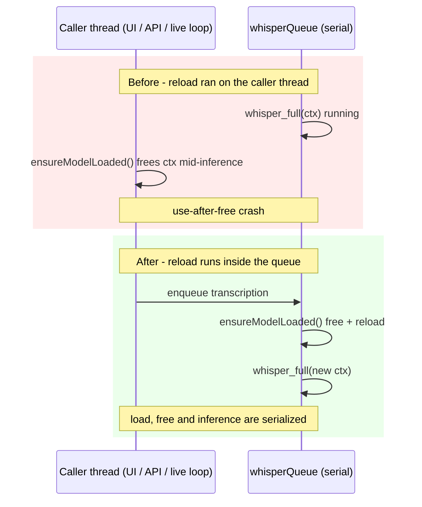

2026-07-08

# WhisperASR: serialize whisper model (re)loading on the inference queue

A session-wide code audit found that switching transcription models could crash the app if any transcription was in flight. `TranscriptionService.ensureModelLoaded()` ran on whatever thread called it — the main thread for file transcriptions, FlyingFox task threads for API requests, the live-transcription task for chunks — while `whisper_full()` executed on the serial `whisperQueue`. When the resolved model path changed, `ensureModelLoaded()` called `whisper_free(ctx)` immediately, on the caller's thread. If a chunk or API request was mid-inference on the queue at that moment, the context was freed out from under `whisper_full()` — a use-after-free. Two concurrent callers (say, an API request arriving during live transcription) could also race on the unsynchronized `ctx` / `loadedModelPath` properties.

The fix moves all context lifecycle onto the queue that already serializes inference:

- `transcribe()` and `transcribeChunk()` call `ensureModelLoaded()` *inside* their `whisperQueue.async` block, and the method now returns the context so the old "load, then separately guard `ctx`" two-step disappears.
- `ensureModelLoaded()` carries a `dispatchPrecondition(.onQueue(whisperQueue))` so any future off-queue call traps loudly in debug instead of corrupting memory quietly.
- `preloadModel()` (used to warm the model when recording starts) dispatches `sync` onto the queue — same blocking behavior as before for its caller, but now ordered with inference.
- `shutdown()` frees the context via `whisperQueue.async`; if the process exits first, the OS reclaims it anyway, which is strictly better than freeing it under a running inference at quit.

One adjacent latent bug fixed in passing: when a model *reload* failed, the old code left `loadedModelPath` pointing at the previous path with `ctx` freed, so switching back to that model skipped the reload and hit a nil context. The reload path now clears both before attempting the new load.
