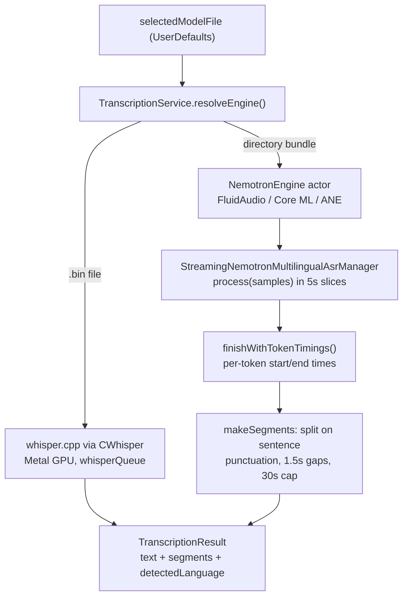

2026-07-16

# WhisperASR: Nemotron 3.5 streaming ASR as a second engine (Core ML / ANE)

WhisperASR now runs NVIDIA's Nemotron-3.5-ASR-Streaming-0.6B — a cache-aware
FastConformer-RNNT streaming model covering about 40 languages with native
punctuation and capitalization — as a second inference engine alongside
whisper.cpp. It executes on the Apple Neural Engine through
[FluidAudio](https://github.com/FluidInference/FluidAudio)'s Core ML port,
added as the project's second SPM dependency. The model appears in the
in-app catalog as "Nemotron 3.5 Multilingual" (about 665 MB) and is selectable
from the toolbar or Settings like any whisper model.

## Why FluidAudio / Core ML and not ONNX Runtime

The first working plan was sherpa-onnx: it supports this exact model, ships
per-chunk-size ONNX exports, and exposes token timestamps and language
selection through a C API. That route was fully vendored (an 82 MB static
xcframework dominated by ONNX Runtime) before being discarded.

The user pushed back — rightly. The FluidInference Core ML port (shipped
June 2026 in FluidAudio v0.15.x) covers every requirement the ONNX route
was chosen for:

- **Token timings** via `finishWithTokenTimings()` — needed for WhisperASR's
  playback-synced transcript highlighting.
- **Language control** via `setLanguage()` (locale codes, `nil` = auto) and
  `detectedLanguage()` for reporting.
- **macOS 14+**, matching the app's deployment target.

And it is strictly better on the axes that matter for a native app: pure
Swift SPM package (no vendored binary in git; app binary grew 7.2 → 14.3 MB
instead of tens of MB), inference on the ANE instead of CPU (FluidAudio's
FLEURS benchmarks: about 73× realtime at the 2240 ms tier on an M2, meeting or
beating NVIDIA's published WER), and Core ML ships with the OS.

One trade-off accepted: the first-ever model load triggers ANE compilation
and took about 2m45s in testing; the OS caches the result and subsequent loads
take about a second. Translation-to-English remains whisper-only — the
Nemotron path returns a clear error for `/v1/audio/translations`.

## How it fits

Engine detection is deliberately structural: whisper models are single
`.bin` files, Nemotron bundles are directories, so `resolveEngine()` just
asks the filesystem. The engines never stay resident together — activating
one frees the other (Breeze-ASR-25 alone is about 3 GB of RAM).

Since the model natively emits punctuation, segments come from the token
stream itself: close a segment on sentence-final punctuation, a >1.5 s
inter-token gap, or a 30 s cap. This gives cleaner sentence-shaped segments
than whisper's, with exact start/end times from the RNNT decode.

## Multi-file model downloads

The catalog previously assumed one model = one file at one URL. Nemotron
bundles are 22 files (four `.mlmodelc` directory trees + `metadata.json` +
`tokenizer.json`). Catalog entries now carry a `DownloadSource`:

- `.file(URL)` — the existing single-file path, unchanged.
- `.hfFolder(repo:folder:)` — lists the Hugging Face repo subtree via the
  HF API at download time (no hardcoded file list), downloads files
  sequentially into `Models/.partial-<name>/`, skips already-complete files
  on resume (plus byte-level resume for the in-flight file), then moves the
  directory into place atomically. `ModelCatalog.isComplete(_:)` keeps
  half-downloaded bundles from counting as installed.

## Verification

End-to-end through the OpenAI-compatible API server (same code path as the
UI): correct English transcript with punctuation, sentence segments with
sane timestamps, `language: "en"` auto-detected. Warm requests about 5 s for a
9.6 s clip; live engine switching Nemotron → whisper → Nemotron confirmed
no whisper regression. Signed release build installed to /Applications.
