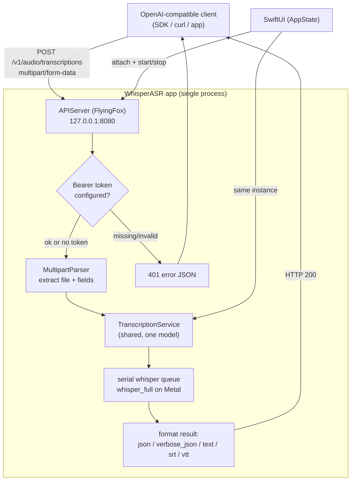

# WhisperASR — OpenAI-compatible local transcription API server

## Summary

WhisperASR now ships an optional local HTTP server that exposes its on-device
whisper.cpp engine through OpenAI's audio API. Any OpenAI-compatible client —
the official SDKs, `curl`, or a third-party app — can point its `base_url` at
`http://127.0.0.1:8080/v1` and get fully local, private transcription using the
model the user already has selected in the app.

Endpoints:

- `POST /v1/audio/transcriptions` — multipart upload (`file`, optional `model`,
  `language`, `response_format`)
- `POST /v1/audio/translations` — same, but whisper translates the audio to English
- `GET /v1/models`

Response formats: `json`, `verbose_json` (timestamped segments), `text`, `srt`, `vtt`.

## Approach

**Reuse the existing engine, add only a front door.** The transcription core was
already a clean async function (`TranscriptionService.transcribe(fileURL:) ->
TranscriptionResult`) returning text plus timestamped segments — which maps almost
1:1 onto OpenAI's response shapes. The work was therefore an HTTP layer, not new AI
plumbing.

**Share one model, not two.** `AppState` owns a single `TranscriptionService`
(holding the ~loaded whisper context). The server is a `@MainActor @Observable`
singleton (`APIServer.shared`) that `AppState` *injects* its service into via
`attach(service:)`. This avoids loading the multi-GB model twice and means every
request serializes on the same existing serial `whisperQueue` — whisper's context
isn't thread-safe, so concurrent API requests simply queue rather than racing the
GPU. The singleton shape mirrors the existing `ModelManager.shared`, so the Settings
scene (which has no `AppState` in its environment) can observe running state directly.

**FlyingFox for HTTP, hand-rolled multipart.** The app had *zero* external SPM
dependencies, so the HTTP library choice mattered. FlyingFox is pure Swift on
`Network.framework` and pulls in no transitive packages (FlyingSocks ships in the
same repo), keeping the dependency surface to a single pin. It hands over the request
body as `Data`; the one genuinely fiddly part — parsing `multipart/form-data` with
binary file content — is a focused ~80-line `MultipartParser` rather than another
dependency.

**Config that behaves sensibly at runtime.** The bearer token is read from
`UserDefaults` *per request*, so changing it in Settings takes effect immediately
without a restart. Port and LAN-binding can't be rebound live, so those fields are
disabled while the server runs and the UI states that toggling off/on is required.
Bind defaults to `127.0.0.1` (IPv4 loopback, the address OpenAI clients expect);
LAN mode binds `0.0.0.0` and surfaces the Mac's reachable IP in Settings.

**Engine extensions.** `TranscriptionService` gained `language` and `translate`
parameters (the latter powering `/v1/audio/translations`), and now reads whisper's
auto-detected language (`whisper_full_lang_id`) into `TranscriptionResult` so
`verbose_json` can report it.

Verified end-to-end against the official `openai` Python SDK (transcriptions +
`verbose_json`), `curl` across all five response formats, the translations and
models endpoints, error cases (missing file → 400, non-multipart → 400, unknown
route → 404), and bearer-token enforcement (401 without/with wrong key, 200 with
correct key).

## Trade-offs

- **Serialized, not parallel.** One shared whisper context means requests run one at
  a time. Correct and memory-frugal for a personal/LAN backend; not a high-throughput
  service. Parallelism would require multiple contexts (multiplied model memory) and
  was deliberately not pursued.
- **Per-request model selection not supported.** Requests use whatever model the app
  has selected; the `model` field in the request is accepted but ignored (switching
  the global selection would disturb the GUI). `GET /v1/models` advertises `whisper-1`
  plus the selected file so clients that validate model names are satisfied.
- **First external dependency.** FlyingFox is now part of the build. Mitigated by it
  being a single pin with no transitive deps; the alternative (Network.framework +
  hand-rolled HTTP/1.1 parsing) was judged more error-prone than worth it.
- **localhost is IPv4-only.** Binding `127.0.0.1` covers the common client default but
  not an IPv6-only `::1` client; chosen for maximum compatibility with typical tools.

## Key Files

- `Sources/APIServer.swift` — *new.* `APIServer` lifecycle/singleton, the
  `OpenAITranscriptionAPI` handlers, OpenAI JSON shapes, SRT/VTT formatting, and the
  `MultipartParser`.
- `Sources/TranscriptionService.swift` — added `language`/`translate` params and
  detected-language reporting.
- `Sources/Models.swift` — `TranscriptionResult.detectedLanguage`.
- `Sources/AppState.swift` — injects the shared service into `APIServer` and
  auto-starts it when enabled.
- `Sources/SettingsView.swift` — "Local API Server" section (toggle, port, token,
  LAN, status + copyable base URL).
- `Package.swift` / `Package.resolved` — FlyingFox dependency.
- `Scripts/build_release.sh` — version bump to 0.6.
- `README.md` / `README.zh-TW.md` / `CLAUDE.md` — docs.

## Update — gated diagnostic logging

Debugging a client that got HTTP 500s exposed a blind spot: the server returned
error reasons only in the HTTP response body, so the run log was silent and
"watch the logs" yielded nothing. (The 500 itself turned out to be WebM/Opus
decoding — see the companion ADR on the ffmpeg fallback.)

Added opt-in per-request logging — content-type, multipart part names, file
name/size/format, and the outcome (including the exact error on failure) — written
to stderr (captured in the run log). It's gated behind the `apiServerVerboseLogging`
flag, **off by default**, and the flag is read *per request* so it toggles live
without restarting the server. Exposed as a "Verbose request logging" toggle in the
Settings "Local API Server" section.

Rationale for gating rather than always-on: normal operation stays quiet, but when a
client misbehaves the flag can be flipped (Settings or `defaults write`) and the next
request's full trace appears immediately — no rebuild, no restart.
