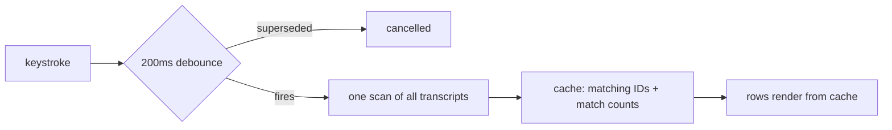

2026-07-08

# WhisperASR: debounce and cache the sidebar transcript search

Typing in the sidebar search field ran two full-text scans per item: `filteredItems` scanned every transcript's `fullText` on each keystroke to filter the list, and `matchCount(for:)` re-scanned each visible item's `fullText` again on every render to draw the "N matches" badge. With a library of hour-long transcripts (tens of KB of text each), each keystroke burned through megabytes of string search on the main thread — typing got visibly janky.

The detail view's transcript search had already solved this shape of problem (debounce + cached results); the sidebar just never got the same treatment. It now works the same way:

One pass per committed query computes both the set of matching item IDs (filename or full-text match) and the per-item match counts, so the previous "filter scan + badge scan" duplication is gone. Rendering reads only the cached dictionary/set. The cache refreshes when items are added or removed while a search is active (`onChange(of: appState.items.count)`), and matching now uses `.caseInsensitive` ranges — the same algorithm the detail view search uses after its own fix.
