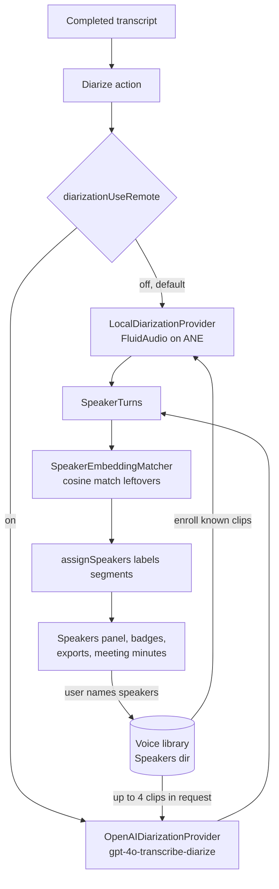

2026-08-14

# WhisperASR: merge speaker diarization with voice enrollment (PR #4)

Merged an external contribution (alexguerra, PR #4) that adds an optional "who spoke when" pass over completed transcripts, plus a voice library so named speakers are recognized again in later recordings. Because the PR came from outside, the session centered on a security review before running or merging anything.

## What the feature does

Diarization runs only on demand, from the transcript view, after transcription. Two engines sit behind a `DiarizationProvider` protocol:

- **On-device (default)** — FluidAudio `DiarizerManager` on the Apple Neural Engine. Reuses the dependency the Nemotron engine already brings in, so no new packages. Models download from Hugging Face on first use.
- **OpenAI (opt-in)** — `gpt-4o-transcribe-diarize`, reusing the OpenAI endpoint/key settings that translation and meeting minutes already share.

Naming speakers once (in the Identify sheet) files each person into a voice library under `Application Support/WhisperASR/Speakers/` with a short WAV clip. Later runs enroll those clips so known voices come back by name; clusters the engine leaves anonymous get a strict one-to-one cosine match against the library's 256-dim embeddings.

## Security review of the external PR

Reviewed the full 1,675-line diff with a finder pass plus an independent spot check of the load-bearing claims. Verdict: clean, no High or Medium findings.

- **Network**: new code contacts only the user-configured OpenAI-compatible endpoint (via a new shared `TranslationService.apiURL(appending:)` helper) and Hugging Face for model downloads — both established patterns. No telemetry, no hardcoded third-party hosts, no obfuscation.
- **Consent**: remote diarization defaults off, hard-fails without an API key, and Settings discloses that the recording and up to 4 known-voice clips upload. Voice clips (biometric-adjacent PII) leave the machine only on that opt-in path.
- **Secrets**: the API key travels only in the Authorization header to the user's endpoint; it is not logged, and the PR adds only the `diarizationUseRemote` boolean to settings backups.
- **Injection**: all voice-library paths are UUID-derived — user-typed speaker names never reach the filesystem; no shell usage; plain `Codable` deserialization into value types.

Below-the-bar notes worth remembering: a crafted audio filename can mangle its own MIME part headers (cosmetic; per-request UUID boundary prevents forging parts); "Skip" in the participants sheet still enrolls the whole library; a restored settings backup could flip the remote toggle on (but backups could already redirect the endpoint and key before this PR).

## How it landed

Checked out `refs/pull/4/head` to a local branch, built and ran the app for hands-on verification of the Speakers panel, Identify sheet, and settings; after the user confirmed the behavior and UI, merged with a merge commit (`73f4755`) to match how PRs #2 and #3 landed, fast-forwarded local main, and deleted the temporary branch. Old transcripts are untouched — the new segment fields are optional, so pre-existing JSON loads as-is.
