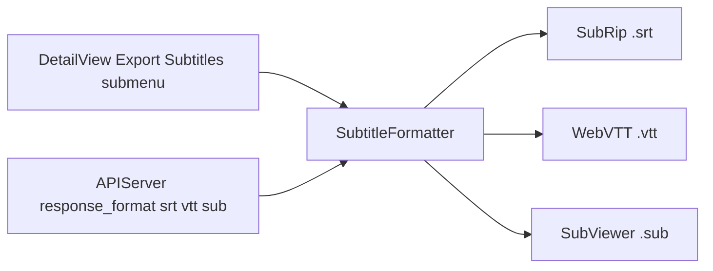

2026-07-30

# WhisperASR: Subtitle Export (SRT, VTT, SubViewer .sub)

## What it does

Completed transcriptions can now be exported as subtitle files directly from the UI. The Export menu in the detail toolbar gains an "Export Subtitles" submenu with three formats: SubRip (.srt), WebVTT (.vtt), and SubViewer (.sub). Each opens a save panel pre-filled with the source media's base name and the matching extension. The submenu only appears when the item actually has timed segments, since subtitles cannot be built from plain text alone.

As a side benefit, the OpenAI-compatible API server now also accepts `response_format=sub` alongside the existing `srt` and `vtt`.

## How it was built

The SRT and VTT renderers already existed, but were private helpers inside `APIServer.swift` (on the `OpenAITranscriptionAPI` handler), unreachable from the UI layer. Rather than duplicate the timestamp math in `DetailView`, the renderers moved into a new shared `Sources/SubtitleFormatter.swift`:

- `SubtitleFormat` — an enum of the three formats, carrying the file extension and a display name for menu items.
- `SubtitleFormatter` — `makeSRT`, `makeVTT`, and the new `makeSUB`, plus the shared clock-part/timestamp helpers.

Both the API server and the new UI export path call the same code, so the two output channels can never drift apart.

## Why SubViewer for .sub

Two unrelated formats share the `.sub` extension:

- **MicroDVD** is frame-based: cues are `{startFrame}{endFrame}Text`, so writing one requires the video's frame rate. An audio transcription app has no frame rate to offer, and guessing one (23.976? 25?) would produce subtitles that drift out of sync.
- **SubViewer 2.0** is time-based: cues are `HH:MM:SS.cc,HH:MM:SS.cc` (centisecond precision) with an `[INFORMATION]/[TITLE]` header block.

SubViewer is therefore the only variant that can be generated correctly from segment timestamps, and it is what players like VLC parse when they detect the header. The exported title field is filled with the media file's base name.

One precision note: SubViewer timestamps are centiseconds, unlike the millisecond precision of SRT/VTT, so `.sub` output rounds each boundary down by up to 9 ms — irrelevant in practice for speech segments.
