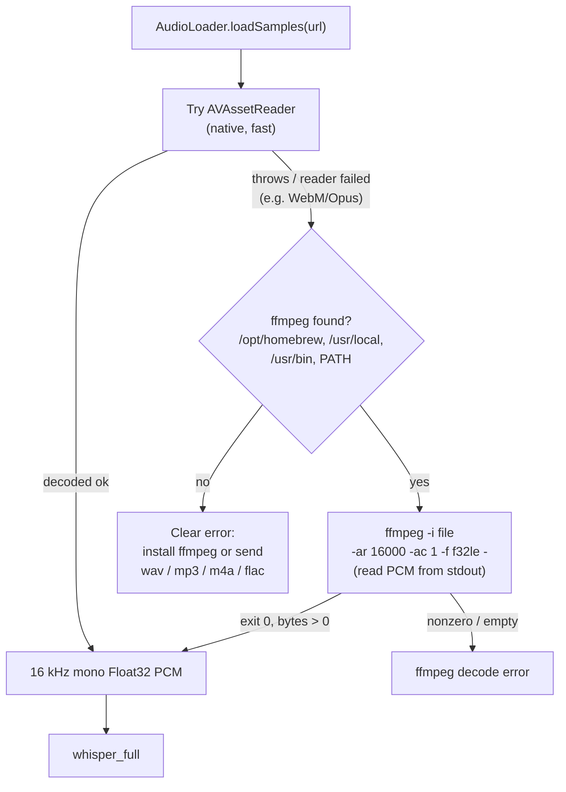

# WhisperASR — WebM/Opus uploads via ffmpeg fallback

## Problem

The new OpenAI-compatible API server returned **HTTP 500** for some clients. The
response body was `{"error":{"type":"server_error","message":"Cannot Open"}}`.
Native formats worked: `mp3`, `aiff`, and `ogg` all returned 200; only `webm`
failed. The failing clients were browser-based — they record with the
`MediaRecorder` API, whose default output is `audio/webm;codecs=opus`.

## Root Cause

`AudioLoader` decoded uploads with **AVFoundation** (`AVAssetReader`), and macOS
AVFoundation cannot open the WebM container / Opus codec. The decode throw was
caught by the API handler and mapped to a generic 500 with AVFoundation's terse
"Cannot Open" message. The real OpenAI transcription API *does* accept WebM, so a
drop-in replacement has to as well — and the same gap would bite anyone dragging a
`.webm` file into the GUI.

A red herring along the way: an early test got `HTTP 000` (connection refused) on
the old port, which looked like a crash. It wasn't — the port had been changed in
Settings from 8080 (which collided with a running `calibre` server) to 11434, so
the test was hitting a dead port while the app was healthy.

## Solution

Make `AudioLoader` fall back to **ffmpeg** when AVFoundation can't decode a file.
AVFoundation stays the primary path (native, fast, no subprocess); on failure the
loader shells out to ffmpeg to decode straight to the format whisper needs —
16 kHz mono float32 PCM — read from stdout:

```
ffmpeg -nostdin -loglevel error -i <file> -ar 16000 -ac 1 -f f32le -
```



Details that matter:

- **ffmpeg discovery.** GUI apps launched from Finder get a minimal PATH that omits
  Homebrew, so the loader probes `/opt/homebrew/bin`, `/usr/local/bin`, `/usr/bin`
  explicitly, then any `PATH` entry.
- **No deadlock.** `-loglevel error` keeps stderr tiny, so draining stdout to EOF
  before `waitUntilExit()` can't wedge on a full stderr pipe.
- **Graceful absence.** If ffmpeg isn't installed, the user gets an actionable
  message ("install ffmpeg … or send WAV, MP3, M4A, FLAC") instead of "Cannot Open".
- **Mid-stream guard.** `AVAssetReader` is now also treated as failed when its
  `status == .failed` after the read loop, so a container AVFoundation only
  half-supports falls through to ffmpeg rather than returning truncated audio.

Verified: `webm` now returns 200 with correct text and `verbose_json` segments;
`mp3`/`aiff` still 200 (no regression).

## Key Files

- `Sources/AudioLoader.swift` — AVFoundation path refactored into `loadViaAVAsset`;
  added `loadViaFFmpeg`, `runFFmpeg`, `findFFmpeg`, and the fallback wrapper.
- `CLAUDE.md` — updated the `AudioLoader` architecture note.

## Lessons Learned

- **A "drop-in OpenAI API" inherits OpenAI's format expectations.** Browser clients
  send WebM/Opus by default; AVFoundation-only decoding silently excludes a large
  class of real clients. Decoding breadth is part of the compatibility contract, not
  an edge case.
- **Bubble up the real decoder error.** "Cannot Open" told the user nothing; the
  fix's actionable message (install ffmpeg / use these formats) turns a dead end
  into a next step.
- **Confirm the obvious before chasing ghosts.** The `HTTP 000` "crash" was just a
  changed port. Checking the listener / process liveness first would have skipped a
  detour. (Default ports collide in the wild — 8080 with calibre here.)
