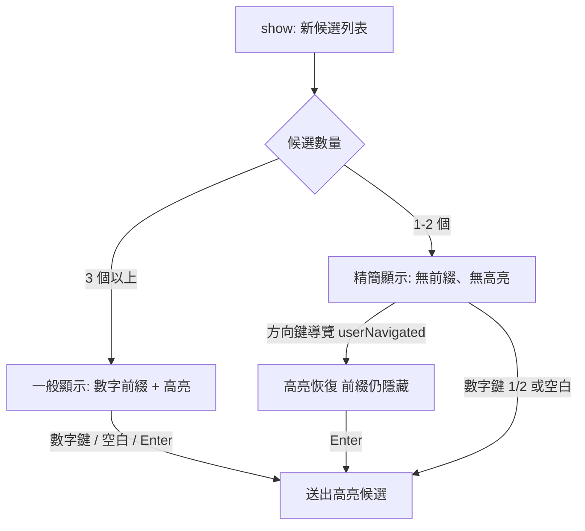

2026-08-13

# Yabomish：候選僅 1–2 個時精簡顯示

候選字窗在候選只有 1–2 個時（最常見於聯想與 emoji 建議），數字前綴「１」「２」和第一個候選上的高亮條其實都是視覺噪音——使用者通常直接按空白鍵送出，根本不需要「選」。這次改動讓選字窗在這種情況下只顯示候選字本身：無數字前綴、無高亮，游標跟隨模式（直向與橫向）和固定位置模式都適用。

## 設計考量：高亮不能一律拿掉

原始需求是「1–2 個候選時不要高亮、不要數字」。但直接照做會默默弄壞一個既有功能：聯想／emoji 候選支援 ←→ 移動選擇 + Enter 確認（v0.3.57 修正過的行為），而 Enter 送出的是 `selectedCandidate()` 指向的高亮項目。如果兩個候選之間移動時看不到焦點，等於盲選。

解法是把「精簡」拆成兩個條件：

- **數字前綴**：純粹看數量（`isCompact`，候選 ≤ 2），永遠隱藏。數字鍵 1/2 仍可選字，因為 `selectByKey` 不依賴顯示。
- **高亮**：預設隱藏，但使用者按方向鍵導覽後恢復（`userNavigated` flag，每次 `show()` 重置）。第一下方向鍵就把焦點移到第二個候選並顯示高亮，跟原本的按鍵次數一致。

## 實作

改動集中在 `CandidatePanel.swift`（約 +16/−6 行）：

- 新增 `userNavigated` 狀態，`moveUp`/`moveDown` 設為 true、`show()` 重置
- `isCompact`／`showsHighlight` 兩個 computed property 集中判斷
- 兩條渲染路徑同步修改：`rebuildLabels()`（游標模式）與 `rebuildFixedLabel()`（固定模式）的前綴組字與高亮屬性各加一個條件

VoiceOver 的「第 N，候選字」朗讀標籤保留不動——看不到數字不代表不能用數字鍵。

驗證：全部 sources typecheck 通過、選字窗 GUI E2E 18/18、單元測試 80/80（E2E 只斷言幾何與選擇行為，不斷言 label 文字，所以既有測試不受影響）。

## 同場加映

同一個 session 也初始化了 repo 的 `CLAUDE.md`（`/init`），記錄了幾個未來容易踩到的點：無 Xcode project 的裸 `swiftc` 建置、版本號來自 CHANGELOG 第一個 `## [x.y.z]` 標題、簽章後 bundle 不可再修改、測試 runner 的 `EXCLUDE` 規則、`Sources/Shared/` 不可 import AppKit/IMK（與 iOS 版共用）。

改動已包進當日以 `release.sh` 建置的 0.3.58 簽章＋公證版本，並安裝到本機驗證。
