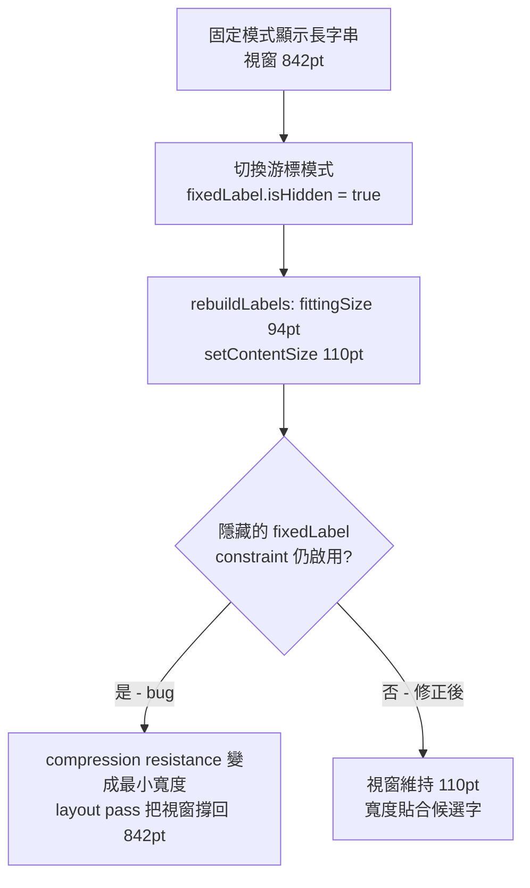

2026-08-12

# Yabomish：游標選字窗寬度不會隨候選字縮小 — 隱藏 fixedLabel 殘留 constraint

## 問題

游標跟隨（橫向）選字窗的寬度不會隨候選字數量縮小：只剩 1–2 個候選字時，選字窗仍維持很寬，候選字擠在左側、右側大片留白。使用者回報時附的截圖裡，`ix` 只剩「0我 1曳」兩個候選，但選字窗幾乎橫跨整個畫面。

程式碼乍看沒問題：`rebuildLabels()` 每次都用 `stackView.fittingSize` 重算寬度再 `setContentSize`，上限是螢幕寬度 80%。用獨立 harness 重現單純的 stackView 佈局，視窗確實會正確縮到 102pt — 所以問題不在縮放邏輯本身。

## 根本原因

`CandidatePanel` 同一個視窗裡有兩套佈局：游標模式的 `stackView`（9 個候選 label）和固定模式的 `fixedLabel`（單一長字串 label，釘在視窗兩側 ±12pt）。切換到游標模式時只做了 `fixedLabel.isHidden = true`，但：

1. **隱藏中的 view，其 Auto Layout constraint 仍然參與佈局**；
2. `fixedLabel` 還保留著上次固定模式／fallback 模式／引導訊息顯示的長文字。

於是殘留文字的 intrinsic width 加上預設 750 的 compression resistance，透過 leading/trailing constraint 變成整個視窗的最小寬度 — `setContentSize` 把視窗縮小後，下一個 layout pass 立刻把視窗撐回舊寬度。把 `fixedLabel`（帶長字串、隱藏、constraint 啟用）加進 harness 後完整重現：`fittingSize` 為 94pt、`setContentSize` 要求 110pt，layout 後視窗仍是 842pt。

這也解釋了為什麼「一開始好好的、用過固定模式（或碰到 fallback、引導訊息）之後就變寬」：`fixedLabel` 初始為空字串，不會撐寬；一旦顯示過長文字就永遠殘留。直向游標模式其實也受同一問題影響。

## 修法

比照既有的 `stackConstraints` 處理方式，把 `fixedLabel` 的三條 constraint 存成 `fixedConstraints`：

- `switchToCursorLayout()`：`deactivate(fixedConstraints)` 再 `activate(stackConstraints)`
- `switchToFixedLayout()`：`deactivate(stackConstraints)` 再 `activate(fixedConstraints)`

harness 驗證：固定模式 842pt → 游標模式 2 候選 109pt → 回固定模式 842pt，兩種模式都正確。使用者實測截圖確認選字窗已貼合單一候選字。

## 相關

- 分支 `fix/cursor-panel-stale-width`（自 main 分出），commit `dea1c41`，PR 送往 FakeRocket543/yabomish
- 附 before/after 截圖進 repo 的 `docs/images/`（該目錄被 gitignore，需 `git add -f`，與既有 webp 圖檔慣例相同）
- CHANGELOG 記在 0.3.58 的「修正」節
