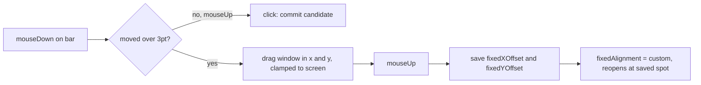

2026-08-14

# Yabomish：固定選字列可任意拖曳並記住位置

固定模式（螢幕下方橫列）的選字列現在可以整條直接拖到螢幕任何位置，放開後位置會被記住——之後每次出現、輸入法重啟、重開機都回到同一個地方。

## 原本的限制

舊版的拖曳其實存在，但幾乎不可用：

- 只能垂直拖動，X 座標每次 reposition 都會被 `fixedAlignment`（靠左／置中／靠右）拉回去。
- 只有抓住文字兩側的細窄留白才能拖——因為 `mouseDown` 一碰到文字就立刻送出候選字，從選字列中間根本拖不動。使用者的感受就是「不能拖」。

## 作法

核心是把「點擊選字」延後到 `mouseUp` 判定，讓整條列都能當拖曳把手：

- **3pt 門檻**：`mouseDown` 只記錄起點，位移超過 3pt 才進入拖曳（換 closed-hand 游標）；沒超過就視為點擊，行為與舊版相同（送出第一個候選）。
- **記住位置**：放開時存兩個偏移——X 存離螢幕左緣距離（新增 `fixedXOffset`），Y 沿用既有的 `fixedYOffset`（Dock 上方偏移），並把 `fixedAlignment` 切成新值 `"custom"`，`repositionFixed()` 據此還原位置。
- **與預設對齊共存**：右鍵選單的靠左／置中／靠右仍可用，選了就蓋掉自訂位置回到預設；自訂位置生效時選單多顯示一列打勾的「自訂（已拖曳）」讓狀態可見。
- **夾回螢幕**：選字列寬度隨候選數變動、解析度也可能改變，所以 reposition 一律把 X/Y 夾回螢幕範圍內，拖到右緣附近也不會跑出畫面。

改動範圍：`YabomishIM/Sources/CandidatePanel.swift`（拖曳邏輯、選單）、`YabomishIM/Sources/Prefs.swift`（`fixedXOffset` 與 `"custom"` 對齊值）。全部 80 個單元測試通過。
