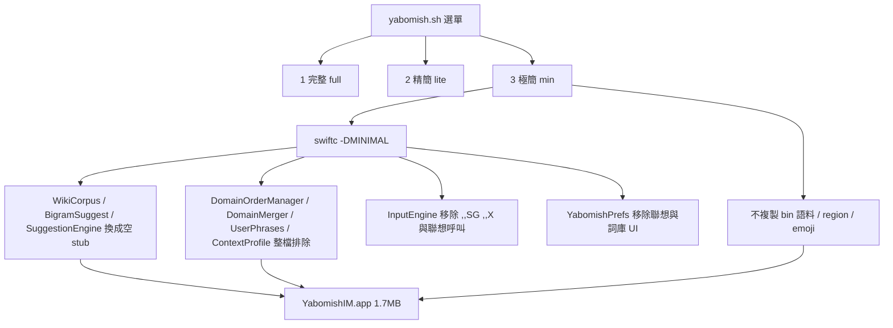

2026-08-12

# Yabomish 極簡安裝模式 — compile flag 移除聯想與詞庫

## 這是什麼

`yabomish.sh` 新增第三種安裝模式「極簡」：以 `-DMINIMAL` 編譯旗標把聯想與詞庫功能（詞級語料、28 專業詞典、成語、萌典、晶晶體、emoji、兩岸用詞）整組從二進位移除，語料完全不複製。輸入法 app 從精簡版的 ~18MB 縮到 **1.7MB**（二進位本身 817KB → 663KB）。

起點是一個問題：「精簡安裝為什麼還要 18MB？」量測後發現精簡版砍的只是專業詞典，聯想引擎的基礎語料（新聞詞頻 5.9MB、維基詞級 bigram 2.8MB、兩岸用詞 2.3MB⋯）全數保留。對只想要「打字」的使用者，這些都是可以拿掉的。

| 模式 | 內容 | 大小 |
|------|------|------|
| 完整 | 28 專業詞典 + 聯想 | ~98MB |
| 精簡 | 聯想（無專業詞典） | ~18MB |
| 極簡（新） | 僅打字＋查碼＋繁簡轉換 | ~1.7MB |

## 設計：stub 與整檔排除並用

關鍵取捨在「怎麼 gate 才不會把 `#if` 撒得到處都是」。Swift 的 `#if` 不能用在函式參數列裡，而 `InputEngine.init` 的預設參數、`CandidateRanker.init` 都直接引用 `SuggestionEngine.shared`、`WikiCorpus.shared` 這些型別。逐一 gate 呼叫端會碰一堆檔案。

做法分兩層：

- **三個入口型別留空 stub**（`WikiCorpus` / `BigramSuggest` / `SuggestionEngine`）：`#if MINIMAL` 分支只留 `shared` 單例與回傳空結果的方法，真實實作（mmap、二分搜尋、四池聯想）全部在 `#else`。呼叫端（`CandidateRanker`、`AppDelegate`、controller 預熱）一行不用改。
- **純聯想的檔案整檔排除**：`DomainOrderManager`、`DomainMerger`、`UserPhrases`、`ContextProfile` 頭尾包 `#if !MINIMAL`。`ContextProfile.swift` 因為是 Prefs 專案的 symlink 共用檔，旗標同時對兩個 app 生效。

行為端只 gate 三處：`InputEngine` 的 `,,SG`、`,,X` 指令分支（極簡版打了會落到「未知命令」）、送字後的聯想呼叫、以及 `,,H` 說明文字（用字串插值抽出那兩行，不用複製整段 heredoc）。

設定程式同一旗標編譯：「聯想與詞庫」整個分頁、輸入頁的聯想卡片、快捷碼頁的詞庫查詢（含它自己那份 WBMM reader）、關於頁的聯想授權條目都消失，`PrefsStore` 對應屬性不編進去。

有一個小陷阱：`Data.u32/u16` extension 定義在 `WikiCorpus.swift` 檔尾，但 `CINTable` 讀 `.bin` 也在用 — gate 時必須把 extension 留在 `#endif` 外面。同理 `CINCompiler` 與 `DomainMerger` 各自有 private 的 append helper，整檔排除 `DomainMerger` 才安全。

## 順手發現：測試套件本來就編不過

跑基準驗證時發現 `run_tests.sh` 已損壞一段時間（CI 只部署文件、不跑測試，所以沒人發現），三層錯誤互相遮蔽：

1. `DomainOrderManager` 在 `Sources/` 與測試 `Stubs.swift` 重複定義（排除清單漏了它）
2. 獨立編譯的 GUI E2E `test_horizontal_panel.swift` 被 `find Tests` 一起撈進來，harness 函式撞名
3. `MockEngineDelegate` 缺後來才加進 protocol 的 `engineDidShowCodeHint(_:duration:)`

三者都已修復，現在 80 passed, 0 failed。這也是「CI 沒跑測試」風險的實例 — 測試爛掉半天沒人知道。

## 驗證

- 兩個 app × 有無 `-DMINIMAL` 四種組合 typecheck 通過
- 實際走 `yabomish.sh` 建置極簡版，確認二進位不含聯想相關符號（`strings` 查長字串；短字串會被 Swift 小字串優化內聯，不能當證據）
- lite 路徑重建驗證：8 個 `.bin` + `emoji_char_map.json` 照常複製，聯想符號存在

PR：https://github.com/FakeRocket543/yabomish/pull/13（另開 `feat/minimal-install-mode` 分支，避免混入當時還開著的游標選字窗 PR #12）
