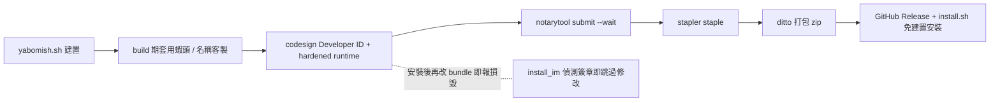

2026-08-12

# Yabomish 簽章公證發布流程與系統風格選單圖示

## 這是什麼

參照 whisperasr 的做法，為 Yabomish 建立完整的 Developer ID 簽章＋Apple 公證發布流程（`release.sh`），並附上隨 release zip 發布的免建置安裝腳本（`install.sh`）。第一個成品已上到 fork：[v0.3.58-min](https://github.com/plateaukao/yabomish/releases/tag/v0.3.58-min) — 極簡版兩個 app，下載解壓直接安裝，不會被 Gatekeeper 擋。

同一輪也把輸入法選單圖示從紅蝦照片換成系統鍵帽風格的「蝦」字，對齊 ABC／あ／한 的樣式。

## 簽章流程

whisperasr 的四步流程直接可用：build → `codesign --deep --options runtime --timestamp` → `notarytool submit --wait`（keychain profile 沿用）→ `stapler staple` 後重新打包。兩個 app 比 whisperasr 還單純 — 純 Swift、無第三方 dylib、不需要任何 entitlements（whisperasr 需要 audio-input，輸入法不用）。兩件提交均一次 Accepted。

`install.sh` 是獨立腳本，因為 `yabomish.sh` 開頭強制檢查 Xcode CLT、且以從源碼建置為前提，對下載 zip 的使用者不合適。新腳本只做：複製兩個 app、建使用者資料夾、部署預設 `,,` 指令、`imklaunchagent` 註冊免登出。

## 事故：安裝後系統報「損毀」

第一次簽章版安裝後，macOS 拒絕載入輸入法並報「已損毀」。根因是 `install_im()` 安裝後會依使用者偏好覆蓋 `icon.tiff`（蝦頭方向）和改 Info.plist（狀態列名稱）— 對未簽章 app 無害，對簽章 app 就是破壞密封資源。`codesign --verify` 直接指出 `file modified: .../icon.tiff`。

更尷尬的是防護其實寫了但沒生效：判斷式用 `codesign -dv` 抓 `Authority=Developer ID`，但 **Authority 鏈要 `-dvv`（verbose 兩級）才會輸出**，單一 `-v` 印的是 Identifier／TeamIdentifier 等，grep 永遠落空。修正為 `-dvv`，並把客製整個往前搬：

- **build 期（簽章前）套用**蝦頭方向與狀態列名稱 — 客製被密封進簽章，簽章版也保有使用者偏好
- `install_im` 偵測到 Developer ID 簽章即跳過安裝後修改，僅未簽章的本機建置維持舊行為

副作用：`release.sh` 產出的發布 zip 會帶著建置機器的蝦頭偏好，出公開 release 前要留意。

## 選單圖示：對齊系統輸入法樣式

輸入法選單裡紅蝦照片夾在 ABC／あ／한 的單色鍵帽之間格外突兀（使用者原話：don't use red）。新圖示是黑色圓角鍵帽＋鏤空「蝦」，關鍵是格式：

- **灰階（W+A）色彩空間** — 選單只對單色圖示做深色模式自動反轉，RGB 黑色不算數；灰階版在深色選單自動變成淺鍵帽＋深字，和系統圖示行為一致
- 多解析度 tiff（16pt @1x/@2x）— 舊圖示只有 16px 單解析度，Retina 上是糊的
- 產生器收進 `tools/gen_menu_icon.swift`，改字符或比例可重生成

三個檔位（`icon.tiff` / `icon_left.tiff` / `icon_right.tiff`）全換成同一張，否則蝦頭方向偏好會把紅蝦蓋回來 — 也因此「蝦頭方向」設定實質失效，後續可考慮從外觀分頁移除。

## 值得記的教訓

1. `codesign -dv` 與 `-dvv` 的輸出差異會讓「檢查是否已簽章」的判斷靜默失敗 — 這類 grep 防護寫完要實測兩個分支。
2. 簽章 app 的鐵律：install 階段不可再碰 bundle。任何 per-user 客製都要移到簽章之前。
3. 輸入法選單圖示要深淺色自適應，條件是「灰階色彩空間」而非只是「看起來是黑白」。
