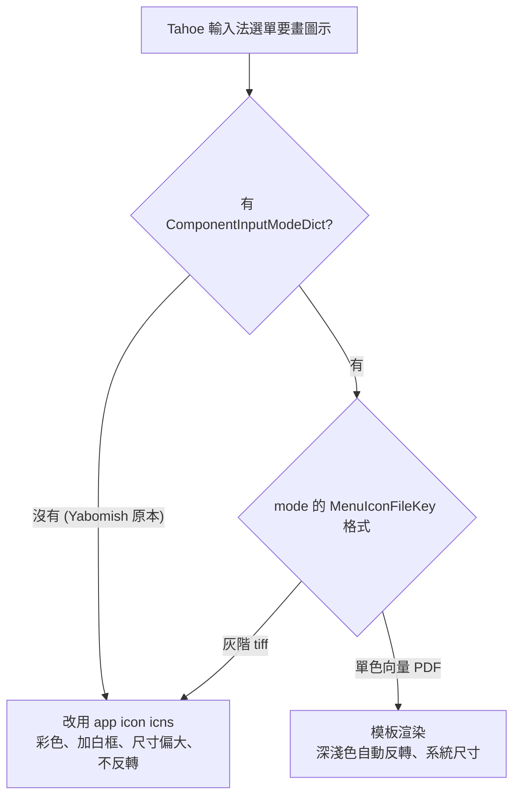

2026-08-13

# Yabomish Tahoe 選單圖示 — input mode 宣告與向量模板 PDF

## 壞掉的東西

前一晚把輸入法選單圖示從紅蝦照片換成系統鍵帽風格的灰階 tiff（`tsInputMethodIconFileKey`），使用者重新登入後選單裡**依舊是紅蝦**。清掉所有輸入法快取（`IntlDataCache`、`tiswitcher.cache`）、重啟 TextInputMenuAgent 都沒用 — 安裝的 tiff 確實是新圖，`TISGetInputSourceProperty(kTISPropertyIconImageURL)` 也指向它，但畫面就是不變。

## 根因：macOS 26 選單根本不讀那張 tiff

用 `lsof` 盯 TextInputMenuAgent，抓到它同時 mmap 了 `icon.tiff` 和 `icon.icns` — 顯示的其實是 **app icon（icon.icns）**，也就是從未在改版範圍內的橘蝦 emoji 照片。Tahoe 的選單圖示解析規則（全部實測，官方文件沒寫）：

三個坑疊在一起，缺一不可：

1. **要有 input mode**。無 mode 的輸入法（原本的 Yabomish）直接 fallback 到 app icon。Apple 內建輸入法與 Squirrel 都是 mode-based。
2. **mode 圖示必須是單色向量 PDF**（比照 Squirrel 的 `rime.pdf`）。灰階 tiff 即使掛在 `tsInputModeMenuIconFileKey` 上仍被退回 app icon。
3. **mode 要有顯示名稱**：選單以 mode dict 的 key 查 `InfoPlist.strings`，查不到就顯示 raw bundle id（使用者截圖裡真的出現 `com.yabomishim.inputmethod.YabomishIM…`）。

## 修法

- `Info.plist` 宣告單一 input mode，**Squirrel 式結構**：mode key＝bundle id、`TISInputSourceID` 另外宣告。McBopomofo 式「key 即完整 mode ID」在 Tahoe 會組出重複段的 source ID（`…IconTest.IconTest.Test`），棄用。
- `tools/gen_menu_icon_pdf.swift` 產生 `menu_icon.pdf`：黑色圓角鍵帽＋even-odd 鏤空「蝦」的單一向量路徑。幾何從使用者選單截圖實測：**22×16pt 橫向鍵帽**（Tahoe 系統鍵帽是橫的！Squirrel 的 16×16 正方形在旁邊反而突兀）、圓角 4pt、字符墨高 9.5pt。深色選單自動反轉成白鍵帽黑字，與 A／あ／한 同款。
- `icon.icns`／`AppIcon.icns` 改為鍵帽「蝦」（`tools/gen_app_icon.swift`）— 現在只出現在 Finder／系統設定，選單不再碰它。
- `en.lproj`／`zh-Hant.lproj` 的 `InfoPlist.strings` 把 mode key 映射為「Yabomish」。
- `yabomish.sh` 打包 `menu_icon.pdf` 與 `*.lproj`。

## 驗證的陷阱（這次繞了不少冤枉路）

- CLI 的 `TISSelectInputSource` 對 mode source 回傳 noErr、`selected=1`，**但 UI 不會真的切換**；`TISCopyCurrentKeyboardInputSource` 回報的又是鍵盤 layout override（ABC），兩個 API 一起誤導。mode-based 輸入法的最終驗收只能靠真人點選單。
- 簽章版 app 裝在 `/Library/Input Methods`（root）後不可改 bundle，每輪迭代都要重建→重簽→sudo 重裝；先在 `~/Library/Input Methods` 放測試 bundle 迭代可以省掉 sudo，但 TIS 註冊快取會殘留，測試 bundle 要用全新 bundle id。
- PlistBuddy 把 key 裡的點號當路徑分隔符，改 mode dict 要用 plistlib。
