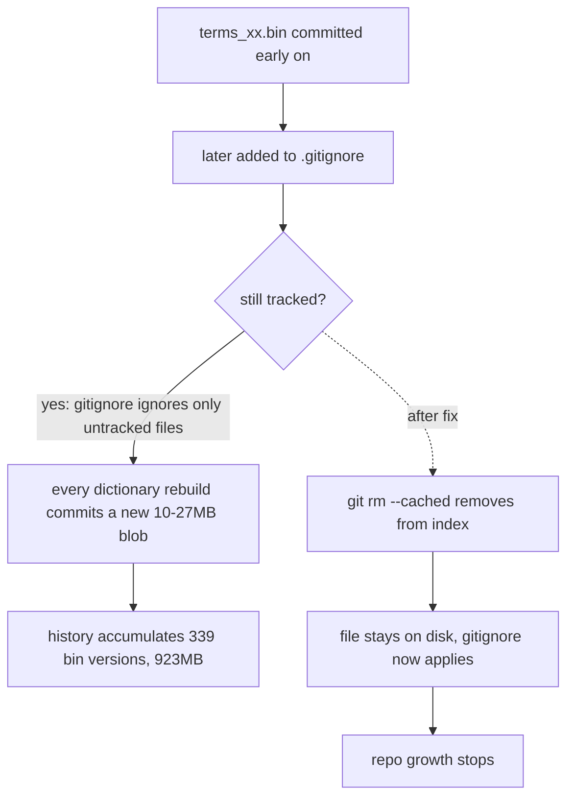

2026-08-12

# yabomish: 停止追蹤已列入 .gitignore 的二進位字典檔

## 問題

yabomish repo 膨脹到 779MB,其中 `.git` 佔 431MB。分析 pack 內容後發現,歷史 blob 總量約 1.18GB,分佈是:

- `YabomishIM/Resources/*.bin`(編譯後的字典檔):**923MB、339 個 blob 版本**,佔近八成
- `yabomish_data/`(字典來源資料、parquet):238MB
- 其餘所有程式碼:僅 17MB

## 根本原因

`.gitignore` 早就列了 `YabomishIM/Resources/*.bin` 和 `yabomish_data/ner/wiki_ner_entities.parquet`,但這些檔案在加入 ignore 規則**之前**就已被 commit。`.gitignore` 只對未追蹤的檔案生效,對已追蹤的檔案毫無作用——所以 44 個 `.bin`(104MB)和 65MB 的 parquet 一直被追蹤,每次重新產生字典就再寫入一份新 blob。二進位檔在 pack 裡幾乎無法 delta 壓縮,每個版本都近乎全額佔用空間,歷史因此不斷膨脹。

另外 `.gitignore` 有一行因缺少換行而黏在一起的規則:`yabomish_data/ner/wiki_ner_entities.parquettrigram_suggest.json`,導致 `trigram_suggest.json` 實際上沒被 ignore(parquet 後面另有一行正確規則)。

## 修法

採「安全版」修正,不改寫歷史:

1. `git rm --cached` 移除 44 個 `Resources/*.bin` 與 `wiki_ner_entities.parquet` 的追蹤(檔案保留在工作目錄)。
2. 把黏住的規則拆回 `trigram_suggest.json`。

commit 後既有的 ignore 規則即接手,未來重建字典不再進入 git。本機 repo 是 `FakeRocket543/yabomish` 的 fork(origin 為 `plateaukao/yabomish`),上游有完全相同的問題,因此加了 `upstream` remote,從 `upstream/main`(與本地 main 相同)開分支 `fix/untrack-ignored-binaries`,PR 開往上游:https://github.com/FakeRocket543/yabomish/pull/11

## 取捨與未竟事項

- 合併後其他 clone pull 時,工作目錄的 `.bin` / `.parquet` 會被 git 刪除,需重新產生;PR 說明中已註明。
- 此修正只**停止未來膨脹**;歷史中已累積的 ~900MB 要用 `git filter-repo` 改寫歷史(全部 commit hash 會變、需 force-push)才能回收,屬破壞性操作,留待上游決定。
- repo 還有幾個「明列於 .gitignore 卻仍被追蹤」的小檔(`tools/gen_pinyin_data.py`、`jingjing_ti_dictionary.txt`),以及 `doc/`+`!doc/*.md` 這種被排除目錄內的否定規則實際無效的問題(git 規定:父目錄被排除後,底下檔案無法用 `!` 重新納入)。這些不影響大小,未納入本次 PR。
